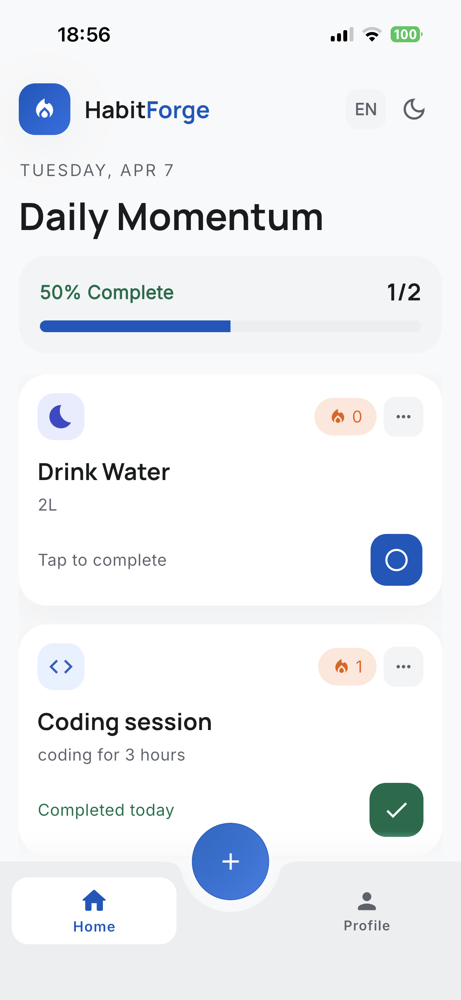
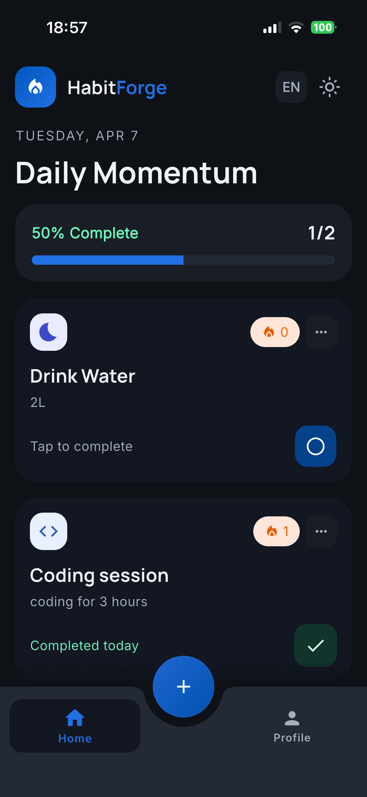
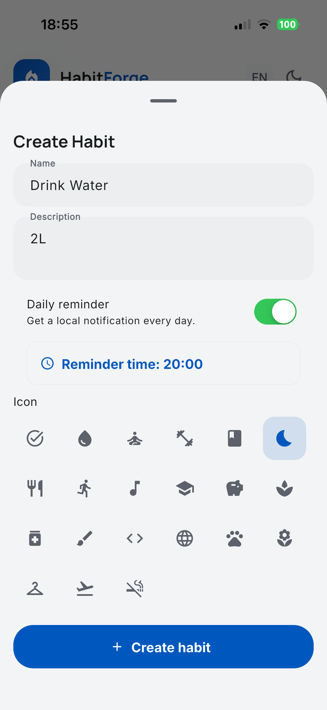
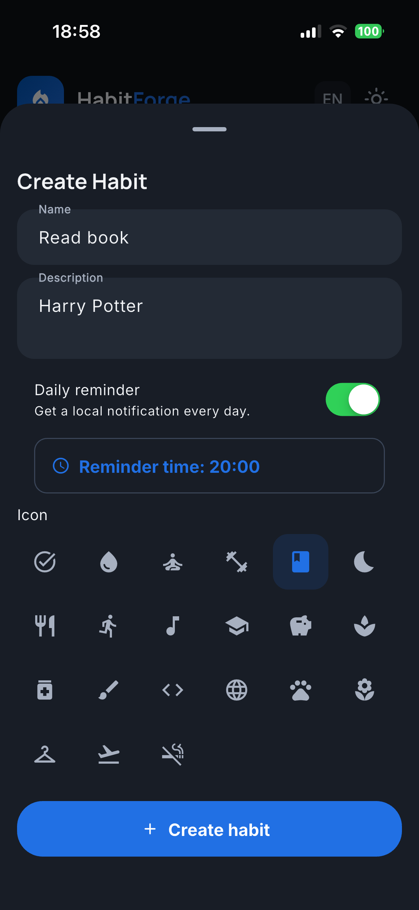
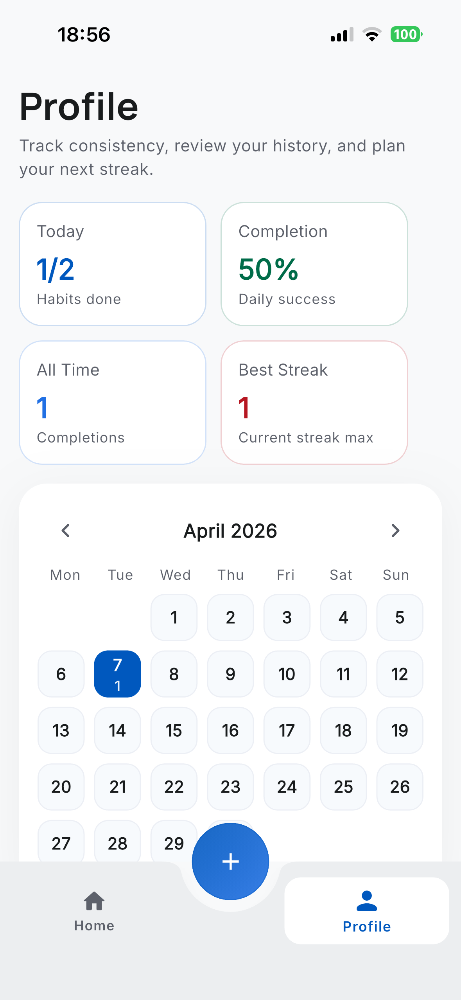
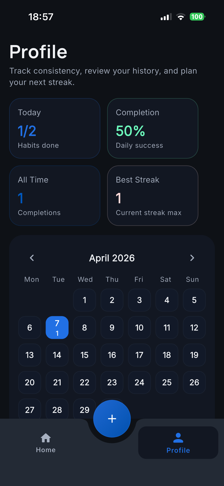
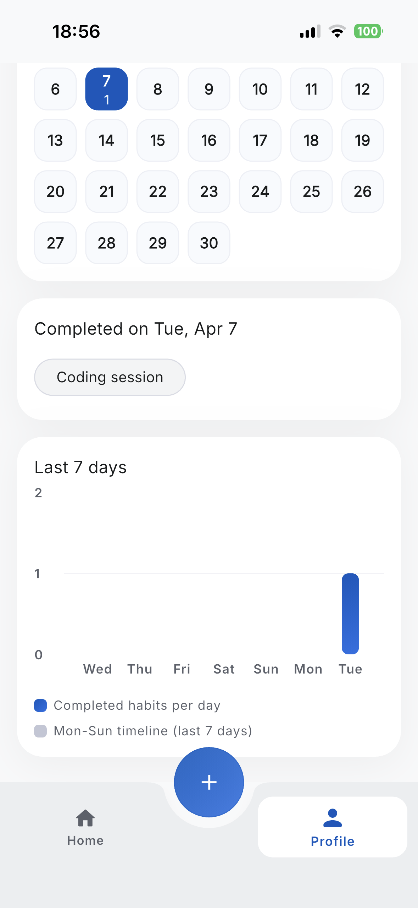
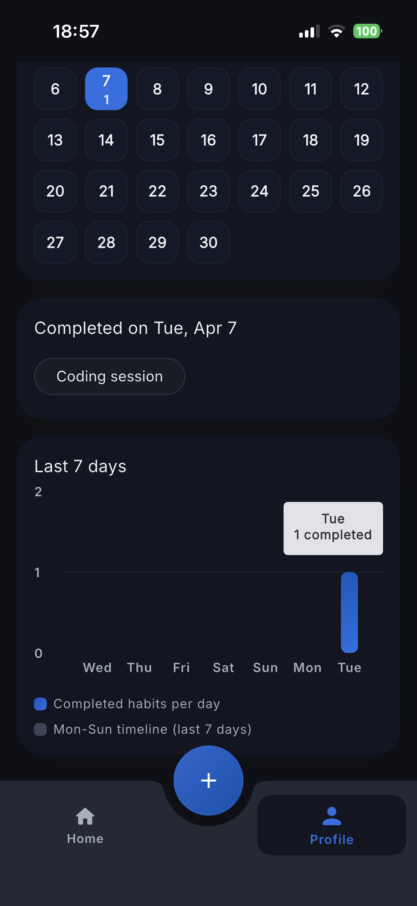
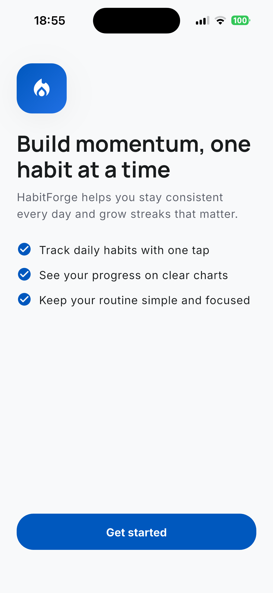

# HabitForge

<p align="center">
	
</p>

[](https://flutter.dev)
[](https://dart.dev)
[](#run-quality-checks)
[](LICENSE)

HabitForge is a Flutter app for building consistency through simple daily habits.
You can create and edit habits, track completions, monitor streaks, and get local daily reminders.

## Highlights

- Habit creation and editing in a bottom sheet form.
- Daily completion tracking with streak logic.
- Profile analytics (summary stats, weekly chart, calendar day details).
- Local notifications for reminders (with app locale support).
- Light and dark theme switching.
- In-app language switching (`en`, `pl`).
- Onboarding flow shown on first launch.

## Tech Stack

- Framework: Flutter (Dart).
- State management: Provider + ChangeNotifier controllers.
- Persistence: Hive local storage.
- Notifications: flutter_local_notifications + timezone.
- Charts: fl_chart.
- Localization: Flutter l10n + ARB files.
- Testing: flutter_test + integration_test + mocktail.

## Architecture

The app follows a clean feature-oriented split by responsibility:

- `controllers/`: UI-facing state and business coordination (`HomeController`, `ThemeController`, `LocaleController`, etc.).
- `services/`: persistence and external integrations (Hive storage, reminder scheduling, onboarding/theme/locale storage).
- `models/`: domain entities (for example `Habit`).
- `views/`: screens and higher-level stateful view composition.
- `widgets/`: reusable UI parts and feature widgets.
- `core/`: shared extensions, helpers, theme, and common UI utilities.
- `l10n/`: generated localization code and source ARB files.

### State Management Approach

- `MultiProvider` is configured in `lib/app.dart`.
- Each domain concern has its own `ChangeNotifier` controller.
- Widgets subscribe with `context.watch` and perform actions via `context.read`.
- Controllers orchestrate services and keep UI logic thin.

## Notifications Behavior

- Reminders are scheduled per habit when reminder is enabled.
- A habit marked as completed today should not fire a reminder for today.
- Reminder title/body follow the selected app locale (`en` / `pl`).

## Project Structure

```text
lib/
	app.dart
	main.dart
	controllers/
	core/
	l10n/
	models/
	services/
	views/
	widgets/
test/
integration_test/
assets/
	screenshots/
```

## Screenshots

### Home

| Light | Dark |
| --- | --- |
|  |  |

### Create/Edit Habit

| Light | Dark |
| --- | --- |
|  |  |

### Profile Analytics

| Light | Dark |
| --- | --- |
|  |  |
|  |  |

### Onboarding



## Roadmap

- [x] Create/edit habits with icon and description.
- [x] Daily completion tracking and streak calculation.
- [x] Local notifications with locale-aware content.
- [x] Profile analytics (stats, weekly chart, selected day details).
- [x] Theme and language switching.
- [ ] Actionable notification buttons (mark done / snooze).
- [ ] Reminder audit/debug screen in-app.
- [ ] Export/import habits (backup and restore).
- [ ] Optional cloud sync.

## Getting Started

### Requirements

- Flutter SDK (matching the project SDK constraints).
- Xcode (iOS) and/or Android Studio toolchain.

### Install and Run

```bash
flutter pub get
flutter run
```

### Run Quality Checks

```bash
bash scripts/ci.sh
```

## License

This project is licensed under the MIT License. See `LICENSE` for details.
